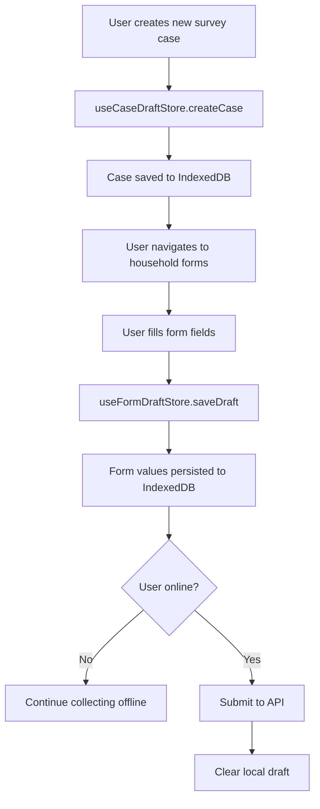

# Application Flows

## 1. App Startup Flow

```
index.html
  └── <script src="/src/app/main.tsx">
        │
        ├── import "./styles/index.css"     → Design system + Tailwind
        ├── import "@shared/config"         → Validates env vars (crashes if missing)
        │
        └── createRoot(#root).render(
              <StrictMode>
                <QueryClientProvider>      → PersistQueryClientProvider
                  │                           ├── queryClient (stale:60s, gc:5m)
                  │                           └── persister (IndexedDB, 24h max age)
                  └── <RouterProvider>     → TanStack Router
                        └── routeTree.gen.ts (auto-generated route tree)
              </StrictMode>
            )
```

**Startup sequence:**
1. Vite loads `index.html` → `main.tsx`
2. CSS design system initializes (CSS variables applied)
3. Environment variables validated (app crashes early if missing)
4. QueryClient created with persistence to IndexedDB
5. Persisted queries rehydrated from IndexedDB
6. Router mounts, resolves initial route
7. Layout route (`_app`) renders sidebar + breadcrumbs
8. Matched page component renders

## 2. Routing Flow

```
URL change
  │
  ├── TanStack Router matches against routeTree.gen.ts
  │
  ├── Layout routes render (nesting):
  │     __root.tsx → Outlet
  │       └── _app/route.tsx → Sidebar + Breadcrumbs + Outlet
  │             └── matched page route
  │
  ├── beforeLoad (per route):
  │     Sets RouteContext { breadcrumb: string }
  │
  └── component renders (code-split, lazy-loaded)
```

**Route context for breadcrumbs:**
```typescript
// Each route sets its breadcrumb via beforeLoad:
beforeLoad: () => ({ breadcrumb: "Master Setup" })

// BreadCrumbs component reads matches:
const matches = useMatches()
// Renders: Home > Master Setup > Municipalities
```

## 3. Authentication Flow (Current State)

```
                    ┌─────────────────────────┐
                    │  localStorage            │
                    │  key: "accessToken"      │
                    └────────────┬────────────┘
                                 │
    Every HTTP request:          │
    ┌────────────────────────────▼──────────────────────┐
    │  Axios Request Interceptor                         │
    │  if (token) headers.Authorization = Bearer ${token}│
    │  headers["x-app-env"] = env.ENV                    │
    └───────────────────────────────────────────────────┘
```

**Current state:** No login page, no auth guards, no token refresh, no logout. This is a placeholder for future implementation.

## 4. Data Fetching Flow

```
Component mounts
  │
  ├── useQuery({ queryKey: entityKeys.list(), queryFn: getEntities })
  │     │
  │     ├── Check: cached in React Query? → Return cached data
  │     │
  │     ├── Check: persisted in IndexedDB? (if meta.persist === true)
  │     │     └── Return persisted + refetch in background
  │     │
  │     └── Fetch from API:
  │           http.get("/entity")
  │             │
  │             ├── Request interceptor: attach Bearer token
  │             │
  │             ├── Response success: return data
  │             │     └── Unwrap ApiResponse<T> → return .data
  │             │
  │             └── Response error:
  │                   └── Normalize to ApiResponse<object> → reject
  │
  └── Query Options:
        staleTime: 60s
        gcTime: 5min
        retry: 2x (skip 4xx except 429)
        refetchOnWindowFocus: false
```

**Query Key Factory Pattern:**
```typescript
export const areaKeys = {
  all: ["areas"] as const,
  list: () => [...areaKeys.all, "list"] as const,
  byDistrict: (id: string) => [...areaKeys.list(), "district", id] as const,
  detail: (id: string) => [...areaKeys.all, "detail", id] as const,
}
```

## 5. Form Submission Flow

```
User fills form
  │
  ├── React Hook Form manages field state
  │     └── Zod schema validates on change/blur/submit
  │
  ├── handleSubmit(onValid):
  │     │
  │     ├── For CREATE:
  │     │     mutation.mutate(formData)
  │     │       └── http.post("/entity", data)
  │     │             └── onSuccess: invalidateQueries(entityKeys.list())
  │     │
  │     ├── For UPDATE (PATCH):
  │     │     const dirty = pickDirtyFields(values, dirtyFields)
  │     │     mutation.mutate({ id, ...dirty })
  │     │       └── http.patch("/entity/:id", dirty)
  │     │             └── onSuccess: invalidateQueries(entityKeys.all)
  │     │
  │     └── For OFFLINE DRAFT:
  │           useFormDraftStore.getState().saveDraft(caseId, formKey, values)
  │             └── Persisted to IndexedDB immediately
  │
  └── Error handling:
        │
        ├── Zod validation error → RHF displays inline errors
        │
        └── Server validation error (422):
              const apiError = error as ApiResponse<object>
              mapServerErrors(apiError.error.details, setError)
                └── PascalCase "Name" → camelCase "name"
                └── Sets per-field errors in RHF
```

## 6. Offline Draft Flow (Case/Survey System)



**Store relationships:**
```
useCaseDraftStore          → Case metadata (id, name, status, timestamps)
  └── useCaseTreeStore     → Hierarchical nodes within a case
       └── useFormDraftStore → Actual form values per node
useCaseUiStore             → Which case/node is currently active (transient)
```

## 7. Error Flow

```
API Error occurs
  │
  ├── Axios response interceptor:
  │     buildError(AxiosError) → normalized ApiResponse<object>
  │     {
  │       success: false,
  │       statusCode: 500,
  │       message: "...",
  │       error: { code, message, details, rowErrors }
  │     }
  │
  ├── React Query level:
  │     ├── Retry logic: up to 2 retries (skip 4xx except 429)
  │     └── queryCache.onError: logs to console
  │          (toast notifications commented out)
  │
  ├── Component level (mutations):
  │     onError callback:
  │       ├── Form validation errors → mapServerErrors → field errors
  │       └── Other errors → display generic message
  │
  └── Route level:
        notFoundComponent → "404 - Page Not Found"
        (No ErrorBoundary currently implemented)
```

## 8. Loading State Flow

```
Component with useQuery:
  │
  ├── isLoading (first load, no cache): Show skeleton/spinner
  ├── isFetching (background refetch): Show stale data + indicator
  ├── isError: Show error state
  └── isSuccess: Render data

Hydration (Zustand + IndexedDB):
  │
  ├── Store created with hydrated: false
  ├── store.hydrate() called → persist.rehydrate()
  └── hydrated: true → Components can render draft data
```

## 9. Theme/UI State Flow

```
useUiStore (Zustand + localStorage)
  │
  ├── theme: "light" | "dark" | "system"
  │     └── Applied via: document.documentElement.setAttribute("data-theme", theme)
  │           └── CSS variables switch between light/dark palettes
  │
  └── sidebarOpen: boolean
        └── Sidebar component reads this for collapse/expand
```
